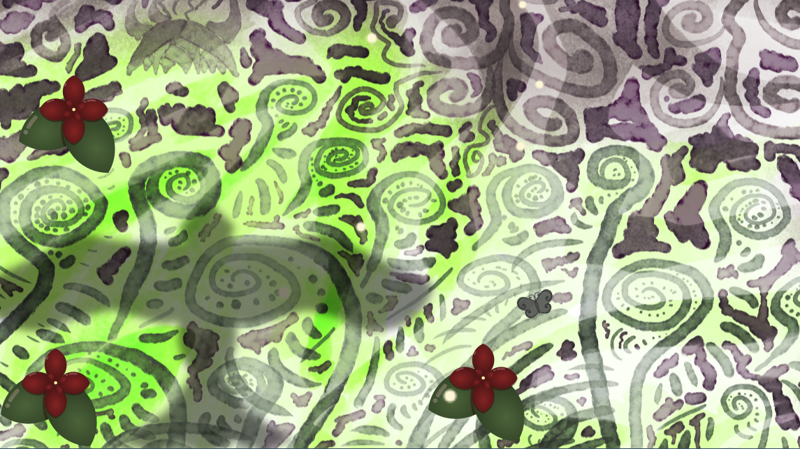

# Butterfly Game 01

Tiny experimental butterfly game made while learning Godot 4.

Fly through a watercolor garden, rest among flowers, and seek shelter when shadows pass overhead.

A small project focused on movement, interaction, game feel, and learning through practice.

> 🚧 Work in progress. Gameplay, artwork, and assets are actively evolving, and many elements may change during development.

## Overview

Guide a butterfly through a watercolor meadow. Explore the environment, rest among flowers, and hide when bird shadows sweep across the landscape.

Additional mechanics, including collecting and progression, are planned.

## Genre

A cozy 2D exploration game with light stealth elements, viewed from the perspective of a butterfly.

## Engine

Godot 4

## Art

Original artwork created by hand, combining watercolor paintings with vector illustrations.
